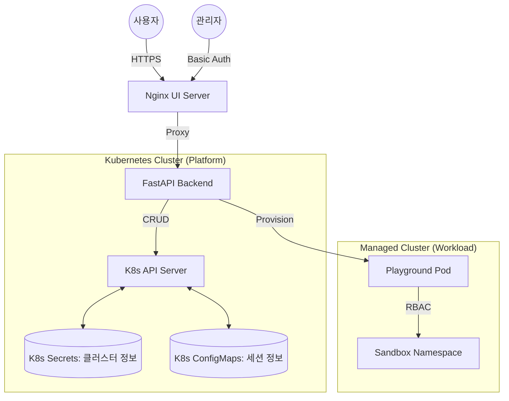

# Kubernetes Playground Platform — 상세 기술 문서

> **마지막 업데이트**: 2026-02-27 | **버전**: v1.7 (Stateless & Bulk Admin 지원)

---

## 목차

1. [프로젝트 개요](#1-프로젝트-개요)
2. [시연 영상 (Demonstration)](#2-시연-영상-demonstration)
3. [시스템 아키텍처](#3-시스템-아키텍처)
4. [핵심 모듈 상세](#4-핵심-모듈-상세)
5. [보안 모델](#5-보안-모델)
6. [배포 가이드 (Helm)](#6-배포-가이드-helm)
7. [관리자 수동 조작 가이드](#7-관리자-수동-조작-가이드)

---

## 1. 프로젝트 개요

### 목적
**Kubernetes Playground Platform**은 학습자가 웹 브라우저만으로 즉시 격리된 Kubernetes 실습 환경을 사용할 수 있도록 하는 플랫폼입니다. 별도의 클라이언트 설치나 SSH 키 관리 없이 브라우저 내장 터미널에서 `kubectl` 명령어를 실행하고, 관리자는 다중 클러스터 및 RBAC 권한을 효율적으로 통합 관리할 수 있습니다.

### 핵심 특징
- **브라우저 터미널**: xterm.js 기반 풀 TTY WebSocket 터미널 (Ticket 기반 보안 인증)
- **무상태(Stateless) 아키텍처**: 모든 상태(세션, 클러스터 정보)를 Kubernetes Secret 및 ConfigMap으로 관리하여 고가용성 보장
- **즉시 프로비저닝**: 버튼 클릭 시 30초 내 `kubectl` 실행 가능한 전용 파드 생성
- **다중 클러스터 관리**: 여러 개의 외부 Kubernetes 클러스터를 동적으로 등록 및 교체 가능
- **고급 관리자 UI**: 플레이그라운드 일괄 생성/삭제, RBAC 실시간 수정, 정렬 및 필터링 기능 제공
- **자동 정리(Sweeper)**: 설정된 만료 시간(`expires_at`)에 도달한 리소스 자동 탐지 및 삭제

---

## 2. 시연 영상 (Demonstration)

### 2.1 관리자 기능 (Admin Page)
플레이그라운드 일괄 관리, 클러스터 등록 및 RBAC 실시간 수정 시연 영상입니다.

https://github.com/user-attachments/assets/c9186c59-922e-4fd9-8f14-102e4e12707f

### 2.2 사용자 기능 (User Page)
플레이그라운드 생성 및 브라우저 내장 터미널을 통한 실습 시연 영상입니다.

https://github.com/user-attachments/assets/2dc262c2-3be3-4472-a3f9-4881a957a761

---

## 3. 시스템 아키텍처

본 플랫폼은 완전한 **Kubernetes-Native** 방식으로 설계되어 별도의 외부 데이터베이스(SQLite 등) 없이 클러스터 리소스만으로 동작합니다.

### 3.1 구성 요소 관계도


---

## 4. 핵심 모듈 상세

### 4.1 Backend (Stateless API)
- **`main.py`**: FastAPI 기반 엔드포인트. 플레이그라운드 생명주기 관리 및 WebSocket 프록시 담당.
- **`k8s_manager.py`**: Kubernetes API 실질적 호출부. 네임스페이스, RBAC, Deployment, Service 생성 및 정리를 담당.
- **`session_manager.py`**: Redis/SQLite 대신 K8s ConfigMap을 사용하여 사용자 세션과 플레이그라운드 ID를 매핑.
- **`cluster_registry.py`**: K8s Secret에 암호화된 kubeconfig를 저장하고 관리하는 멀티 클러스터 레지스트리.
- **`utils.py`**: K8s 클라이언트 초기화 및 공통 유틸리티 코드 통합.

### 4.2 Frontend (Dynamic UI)
- **`index.html`**: 사용자용 터미널 인터페이스. xterm.js를 통한 실시간 터미널 연결 및 SSH 접속 정보 제공.
- **`admin.html`**: 관리자용 대시보드. 클러스터 등록, 플레이그라운드 목록 관리(정렬/필터링), 일괄 RBAC 수정 기능.

---

## 5. 보안 모델

| 보안 영역 | 적용 기술 | 상세 내용 |
|---|---|---|
| **터미널 보안** | Ticket Auth | WebSocket 연결 시 단기 유효 일회용 티켓을 발급하여 권한 없는 접근 차단 |
| **관리자 인증** | bcrypt | 관리자 비밀번호를 안전한 해시 형태로 Secret에 저장하여 유출 시 대비 |
| **RBAC 격리** | Sandbox NS | 사용자마다 독립된 네임스페이스를 생성하고 특정 권한(Role)만 부여 |
| **통신 암호화** | RSA 4096 | SSH 접속 시 매번 고유한 4096비트 키페어를 생성하여 전송 |
| **데이터 보호** | K8s Secret | 외부 클러스터의 kubeconfig 등 민감 정보를 K8s Secret으로 암호화 저장 |

---

## 6. 배포 가이드 (Helm)

본 프로젝트는 **Helm**을 통해 쉽고 표준화된 방식으로 배포할 수 있습니다.

### 6.1 사전 요구 사항
- Kubernetes 클러스터 연결 설정 (`kubectl control`)
- Helm v3+ 설치
- Python3 (배포 스크립트 실행용)

### 6.2 배포 단계
1. **의존성 설치**:
   ```bash
   pip install bcrypt cryptography
   ```
2. **배포 실행**:
   `ADMIN_PASS` 환경변수를 통해 관리자 비밀번호를 지정하며 배포합니다.
   ```bash
   ADMIN_PASS="your-secure-password" ./helm-deploy.sh
   ```

### 6.3 주요 배포 옵션 (`values.yaml`)
- `image.tag`: 현재 버전 `v17` 사용 권장
- `service.nodePort`: 기본값 `30800` (외부 접속 포트)
- `kubeInsecure`: 자체 서명 인증서 클러스터일 경우 `"true"`로 설정

---

## 7. 관리자 수동 조작 가이드

### 7.1 플레이그라운드 일괄 관리
관리자 페이지에서 여러 플레이그라운드를 선택한 후 상단의 **[Bulk Edit RBAC]** 또는 **[Bulk Delete]** 버튼을 통해 한 번에 작업을 처리할 수 있습니다.

### 7.2 수동 리소스 정리
플랫폼 파드가 비정상 종료되더라도, 리소스는 Kubernetes Label (`app=playground`)로 식별 가능합니다.
```bash
# 특정 네임스페이스의 모든 플레이그라운드 삭제
kubectl delete deploy,svc,secret -n study -l app=playground
```

---

*본 문서는 프로젝트의 최신 상태를 반영하고 있으며, 추가적인 문의 사항은 개발팀으로 연락 바랍니다.*
